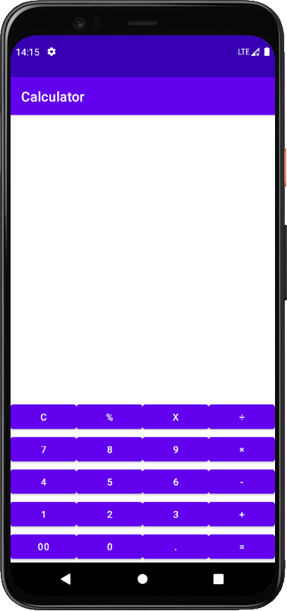

# Android_Calculator

### 一、实验目的

1. 了解Android环境的搭建；

2. 理解并掌握Layout;

3. 理解并掌握常见的控件使用方法；

4. 理解并掌握菜单；

5. 理解并掌握事件处理机制；

6. 理解并掌握Intent使用方法；

7. 初步了解ActionBar和Fragment使用。

   

### 二、实验要求

1. 课前预习实验内容，并查找相关资料。

2. 按照实验步骤完成各个相关内容。

3. 撰写实验报告。

   a) 实验报告格式必须符合学校要求；

   b) 写出实验详细步骤，包括主要采用的技术方案、相关分析和核心代码。注意：不要简单地近包括截屏和代码，完整代码可以作为附录放在实验报告结尾；

   c) 总结实验中遇到的问题、分析和解决方法。

   d) 写出心得体会与收获等。

   

### 三、实验步骤

主要分为几个大步骤进行实现：

1. 需求分析，调研计算器具有哪些功能，确定界面。

2. 系统设计，对计算器进行模块划分，确定技术方案。

3. 编码，编写代码实现各项功能。

4. 测试。

   

#### 1. 需求分析

计算器是较为实用的一种应用程序。为简单起见，我们这里仅实现基本功能。

##### 1.1 主要功能

1. 支持整数和小数运算（内部采用浮点，允许一定误差）。

2. 支持加减乘除、括号等运算。

3. 支持连续加、减等复杂运算。

4. 支持sin,cos,幂等多种函数计算。

5. 支持单位换算。

6. 支持进制转换。

7. 支持十进制、二进制、十六进制、八进制等互相转换。

8. 更多功能请参考Windows自带的计算器。

##### 1.2 界面设计

当用户按下菜单键后，弹出选项菜单，其中至少包括help和exit菜单。其中help仅显示一行文本即可：这是帮助。

#### 2. 系统设计

系统设计给出模块划分和技术方案等。模块可以包括：主界面模块，计算模块，进制转换模块，帮助模块等。

#### 3. 项目实施

主要步骤：

1. 创建工程

2. 编写各界面布局、菜单等资源文件

3. 编写界面处理代码

   

#### 4. 测试

编写完后对项目进行测试，看是否实现了各个功能。

程序运行结果如下所示：

